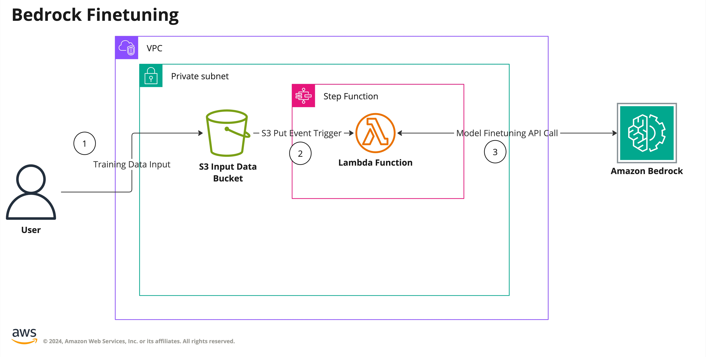

# Amazon Bedrock Finetuning

## Description

The manifest `manifests/bedrock-finetuning-sfn/deployment.yaml` deploys a finetuning job for Amazon Bedrock.

The module creates a finetuning job for Amazon Bedrock model of choice. Finetuning is triggered by dropping new file into created S3 Bucket. This triggers step function execution that using Lambda invokes the finetuning job and provides all the necessary parameters. You can expand this solution by adding more steps to the step function or by adding other modules. The manifest uses networking module to create the resources inside a VPC. 

### Architecture

## Deployment

For deployment instructions, please refer to [DEPLOYMENT.MD](https://github.com/awslabs/aiops-modules/blob/main/DEPLOYMENT.md).

## User Guide

### Running Finetuning Job

Below are the steps to run the Finetuning Job. The steps assume you have deployed the manifest

1. Upload Training Data to an S3 Bucket. Make sure the data is ina format accepted by the specified model. 

2. The S3 Put event will trigger the finetuning job in Bedrock. You can verify if the job started in Bedrock Console. 
3. After the job completes you can use fine-tuned model in your application.

