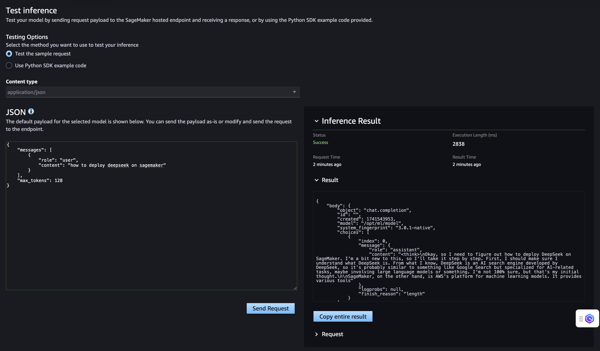

# DeepSeek R1 on Amazon Sagemaker JumpStart

## Description

The manifest `manifests/deepseek-sagemaker/deployment.yaml` deploys [DeepSeek R1 Distill Llama 8B](https://huggingface.co/deepseek-ai/DeepSeek-R1-Distill-Llama-8B) Large Language Model on Amazon SageMaker JumpStart.

### Modules Inventory

- [SageMaker JumpStart Endpoint Module](modules/fmops/sagemaker-jumpstart-fm-endpoint/README.md)
- [SageMaker Studio Module](modules/sagemaker/sagemaker-studio/README.md)
- [Networking Module](https://github.com/awslabs/idf-modules/tree/main/modules/network/basic-cdk)

## Deployment

### Request Quota Increase

1. Navigate to `Service Quotas` > `AWS services` > `Amazon SageMaker` > `ml.g6.12xlarge for endpoint usage` and request an increase of 1 instance (the default is 0).

### Deploy Manifest

For deployment instructions, please refer to [DEPLOYMENT.MD](https://github.com/awslabs/aiops-modules/blob/main/DEPLOYMENT.md). You will need to deploy the following manifest: `manifests/deepseek-sagemaker/deployment.yaml`.

## User Guide

### Test Inference using Amazon SageMaker AI Studio IDE

1. Navigate to `Amazon Sagemaker AI` > `Domains` > choose your domain > `User Profiles` and launch Studio as `lead-ds-user-1` user.

2. In the Studio, navigate to `Deployments` > `Endpoints`, click on the endpoint name and choose `Test Inference` tab. 

3. Enter your prompt and click `Send Request`:

