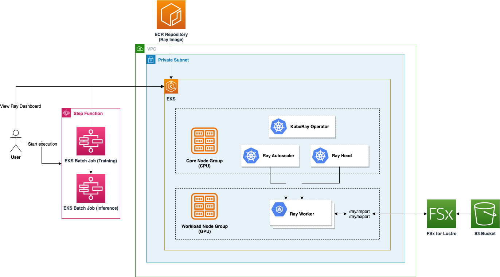
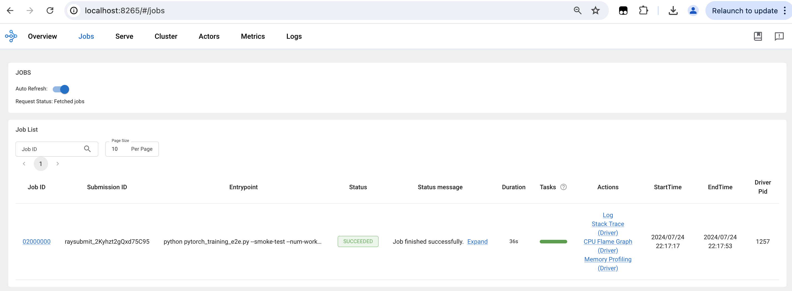

# Ray on Amazon Elastic Kubernetes Service

## Description

The manifest `manifests/ray-on-eks/deployment.yaml` deploys Ray on Amazon EKS.

It provisions an [Amazon EKS](https://docs.aws.amazon.com/eks/latest/userguide/what-is-eks.html) cluster with 2 node groups: 
Core (CPU) and Workload (GPU) and deploys [KubeRay](https://github.com/ray-project/kuberay) Ray Operator, and a Ray Cluster 
with autoscaling and mounted high-performance [Amazon FSx for Lustre](https://docs.aws.amazon.com/fsx/latest/LustreGuide/what-is.html)
file system. Additionally, a custom Ray container image is supported.

### Architecture



### Modules Inventory

- [Ray Operator Module](modules/eks/ray-operator/README.md)
- [Ray Cluster Module](modules/eks/ray-cluster/README.md)
- [Ray Orchestrator Module](modules/eks/ray-orchestrator/README.md)
- [Ray Image Module](modules/eks/ray-image/README.md)
- [EKS Module](https://github.com/awslabs/idf-modules/tree/main/modules/compute/eks)
- [FSx for Lustre Module](https://github.com/awslabs/idf-modules/tree/main/modules/storage/fsx-lustre)
- [FSx for Lustre on EKS Integration Module](https://github.com/awslabs/idf-modules/tree/main/modules/integration/fsx-lustre-on-eks)
- [Networking Module](https://github.com/awslabs/idf-modules/tree/main/modules/network/basic-cdk)
- [ECR Module](https://github.com/awslabs/idf-modules/tree/main/modules/storage/ecr)
- [Buckets  Module](https://github.com/awslabs/idf-modules/tree/main/modules/storage/buckets)

## Deployment

For deployment instructions, please refer to [DEPLOYMENT.MD](https://github.com/awslabs/aiops-modules/blob/main/DEPLOYMENT.md).

## User Guide

### Submitting Jobs

After deploying the manifest, follow the steps below to submit a job to the cluster.

1. Connect to EKS cluster
```
aws eks update-kubeconfig --region us-east-1 --name eks-cluster-xxx
```

2. Check that Ray cluster and operator pods are running:

```
kubectl get pods --all-namespaces

NAMESPACE     NAME                                                        READY   STATUS    RESTARTS   AGE
...
ray           kuberay-operator-...                                        1/1     Running   0          11m
ray           ray-cluster-kuberay-head-...                                1/1     Running   0          11m
ray           ray-cluster-kuberay-worker-workergroup-...                  1/1     Running   0          11m
ray           ray-cluster-kuberay-worker-workergroup-...                  1/1     Running   0          11m
```

3. Check Ray service is running:

```
kubectl get services -n ray

NAME               TYPE        CLUSTER-IP       EXTERNAL-IP   PORT(S)                                         AGE
kuberay-head-svc   ClusterIP   ...              <none>        10001/TCP,8265/TCP,8080/TCP,6379/TCP,8000/TCP   64s
kuberay-operator   ClusterIP   ...              <none>        8080/TCP                                        6m3s
```

4. Get Ray service endpoint:

```
kubectl get endpoints -n ray

NAME               ENDPOINTS                                                      AGE
kuberay-head-svc   ...:8080,...:10001,...:8000 + 2 more...                        98s
kuberay-operator   ...:8080                                                       6m37s
```

5. Set up port forwarding:

```
kubectl port-forward -n ray --address 0.0.0.0 service/kuberay-head-svc  8265:8265
```

6. Submit a dummy Ray job:
```
ray job submit --address http://localhost:8265 -- python -c "import ray; ray.init(); print(ray.cluster_resources())"
```

7. For a more elaborate example, create a file `pytorch_training_e2e.py` with the following content:

```python
import click
import time
import json
import os
import tempfile
from typing import Dict

import numpy as np
from torchvision import transforms
from torchvision.models import resnet18
import torch
import torch.nn as nn
import torch.optim as optim

import ray
from ray import train
from ray.train import Checkpoint, RunConfig, ScalingConfig
from ray.train.torch import TorchTrainer


def add_fake_labels(batch: Dict[str, np.ndarray]) -> Dict[str, np.ndarray]:
    batch_size = len(batch["image"])
    batch["label"] = np.zeros([batch_size], dtype=int)
    return batch


def transform_image(
    batch: Dict[str, np.ndarray], transform: torch.nn.Module
) -> Dict[str, np.ndarray]:
    transformed_tensors = [transform(image).numpy() for image in batch["image"]]
    batch["image"] = transformed_tensors
    return batch


def train_loop_per_worker(config):
    raw_model = resnet18(pretrained=True)
    model = train.torch.prepare_model(raw_model)
    criterion = nn.CrossEntropyLoss()
    optimizer = optim.SGD(model.parameters(), lr=0.001, momentum=0.9)

    train_dataset_shard = train.get_dataset_shard("train")

    for epoch in range(config["num_epochs"]):
        running_loss = 0.0
        for i, data in enumerate(
            train_dataset_shard.iter_torch_batches(batch_size=config["batch_size"])
        ):
            # get the inputs; data is a list of [inputs, labels]
            inputs = data["image"].to(device=train.torch.get_device())
            labels = data["label"].to(device=train.torch.get_device())
            # zero the parameter gradients
            optimizer.zero_grad()

            # forward + backward + optimize
            outputs = model(inputs)
            loss = criterion(outputs, labels)
            loss.backward()
            optimizer.step()

            # print statistics
            running_loss += loss.item()
            if i % 2000 == 1999:  # print every 2000 mini-batches
                print(f"[{epoch + 1}, {i + 1:5d}] loss: {running_loss / 2000:.3f}")
                running_loss = 0.0

        with tempfile.TemporaryDirectory() as tmpdir:
            torch.save(model.state_dict(), os.path.join(tmpdir, "model.pt"))
            train.report(
                dict(running_loss=running_loss),
                checkpoint=Checkpoint.from_directory(tmpdir),
            )


@click.command(help="Run Batch prediction on Pytorch ResNet models.")
@click.option("--data-size-gb", type=int, default=1)
@click.option("--num-epochs", type=int, default=2)
@click.option("--num-workers", type=int, default=1)
@click.option("--smoke-test", is_flag=True, default=False)
def main(data_size_gb: int, num_epochs=2, num_workers=1, smoke_test: bool = False):
    data_url = (
        f"s3://anonymous@air-example-data-2/{data_size_gb}G-image-data-synthetic-raw"
    )
    print(
        "Running Pytorch image model training with "
        f"{data_size_gb}GB data from {data_url}"
    )
    print(f"Training for {num_epochs} epochs with {num_workers} workers.")
    start = time.time()

    if smoke_test:
        # Only read one image
        data_url = [data_url + "/dog.jpg"]
        print("Running smoke test on CPU with a single example")
    else:
        print(f"Running GPU training with {data_size_gb}GB data from {data_url}")

    dataset = ray.data.read_images(data_url, size=(256, 256))

    transform = transforms.Compose(
        [
            transforms.ToTensor(),
            transforms.Resize(256),
            transforms.CenterCrop(224),
            transforms.Normalize(mean=[0.485, 0.456, 0.406], std=[0.229, 0.224, 0.225]),
        ]
    )

    dataset = dataset.map_batches(add_fake_labels)
    dataset = dataset.map_batches(transform_image, fn_kwargs={"transform": transform})

    trainer = TorchTrainer(
        train_loop_per_worker=train_loop_per_worker,
        train_loop_config={"batch_size": 64, "num_epochs": num_epochs},
        datasets={"train": dataset},
        scaling_config=ScalingConfig(
            num_workers=num_workers, use_gpu=int(not smoke_test)
        ),
        run_config=RunConfig(storage_path="/ray/export"),
    )
    trainer.fit()

    total_time_s = round(time.time() - start, 2)

    # For structured output integration with internal tooling
    results = {"data_size_gb": data_size_gb, "num_epochs": num_epochs}
    results["perf_metrics"] = [
        {
            "perf_metric_name": "total_time_s",
            "perf_metric_value": total_time_s,
            "perf_metric_type": "LATENCY",
        },
        {
            "perf_metric_name": "throughout_MB_s",
            "perf_metric_value": round(
                num_epochs * data_size_gb * 1024 / total_time_s, 2
            ),
            "perf_metric_type": "THROUGHPUT",
        },
    ]

    test_output_json = os.environ.get("TEST_OUTPUT_JSON", "/tmp/release_test_out.json")
    with open(test_output_json, "wt") as f:
        json.dump(results, f)

    print(results)


if __name__ == "__main__":
    main()
```

8. Submit the job:

```
ray job submit --address http://localhost:8265 --working-dir="." -- python pytorch_training_e2e.py
```

9. Access the Ray Dashboard at `http://localhost:8265`:



### Submitting Jobs from a Pod using Batch Job

1. Connect to EKS cluster
```
aws eks update-kubeconfig --region us-east-1 --name eks-cluster-xxx
```

2. Check that Ray cluster and operator pods are running:

```
kubectl get pods --all-namespaces

NAMESPACE     NAME                                                        READY   STATUS    RESTARTS   AGE
...
ray           kuberay-operator-...                                        1/1     Running   0          11m
ray           ray-cluster-kuberay-head-...                                1/1     Running   0          11m
ray           ray-cluster-kuberay-worker-workergroup-...                  1/1     Running   0          11m
ray           ray-cluster-kuberay-worker-workergroup-...                  1/1     Running   0          11m
```

3. Check Ray service is running:

```
kubectl get services -n ray

NAME               TYPE        CLUSTER-IP       EXTERNAL-IP   PORT(S)                                         AGE
kuberay-head-svc   ClusterIP   ...              <none>        10001/TCP,8265/TCP,8080/TCP,6379/TCP,8000/TCP   64s
kuberay-operator   ClusterIP   ...              <none>        8080/TCP                                        6m3s
```

4. Create a file `pytorch_training_e2e.yaml` with the following content:

```yaml
apiVersion: batch/v1
kind: Job
metadata:
  name: pytorch-training-e2e-1
  namespace: ray
spec:
  template:
    spec:
      serviceAccountName: ray-operator-ray-operator
      containers:
      - name: pytorch-training-e2e
        image: python:3.9.19
        command: ['sh', '-c', 'pip install ray"[default,client]"==2.30.0 && cd /home/ray/sample/ && ray job submit --address ${RAY_ADDRESS} --working-dir="." -- python pytorch_training_e2e.py']
        env:
          - name: RAY_ADDRESS
            value: "http://kuberay-head-svc:8265"
        volumeMounts:
        - name: code-sample
          mountPath: /home/ray/sample
      restartPolicy: Never
      volumes:
        - name: code-sample
          configMap:
            name: pytorch-training-e2e
            items:
              - key: pytorch_training_e2e.py
                path: pytorch_training_e2e.py
---
apiVersion: v1
kind: ConfigMap
metadata:
  name: pytorch-training-e2e
  namespace: ray
data:
  pytorch_training_e2e.py: |
    import click
    import time
    import json
    import os
    import tempfile
    from typing import Dict
    
    import numpy as np
    from torchvision import transforms
    from torchvision.models import resnet18
    import torch
    import torch.nn as nn
    import torch.optim as optim
    
    import ray
    from ray import train
    from ray.train import Checkpoint, RunConfig, ScalingConfig
    from ray.train.torch import TorchTrainer
    
    
    def add_fake_labels(batch: Dict[str, np.ndarray]) -> Dict[str, np.ndarray]:
        batch_size = len(batch["image"])
        batch["label"] = np.zeros([batch_size], dtype=int)
        return batch
    
    
    def transform_image(
        batch: Dict[str, np.ndarray], transform: torch.nn.Module
    ) -> Dict[str, np.ndarray]:
        transformed_tensors = [transform(image).numpy() for image in batch["image"]]
        batch["image"] = transformed_tensors
        return batch
    
    
    def train_loop_per_worker(config):
        raw_model = resnet18(pretrained=True)
        model = train.torch.prepare_model(raw_model)
        criterion = nn.CrossEntropyLoss()
        optimizer = optim.SGD(model.parameters(), lr=0.001, momentum=0.9)
    
        train_dataset_shard = train.get_dataset_shard("train")
    
        for epoch in range(config["num_epochs"]):
            running_loss = 0.0
            for i, data in enumerate(
                train_dataset_shard.iter_torch_batches(batch_size=config["batch_size"])
            ):
                # get the inputs; data is a list of [inputs, labels]
                inputs = data["image"].to(device=train.torch.get_device())
                labels = data["label"].to(device=train.torch.get_device())
                # zero the parameter gradients
                optimizer.zero_grad()
    
                # forward + backward + optimize
                outputs = model(inputs)
                loss = criterion(outputs, labels)
                loss.backward()
                optimizer.step()
    
                # print statistics
                running_loss += loss.item()
                if i % 2000 == 1999:  # print every 2000 mini-batches
                    print(f"[{epoch + 1}, {i + 1:5d}] loss: {running_loss / 2000:.3f}")
                    running_loss = 0.0
    
            with tempfile.TemporaryDirectory() as tmpdir:
                torch.save(model.state_dict(), os.path.join(tmpdir, "model.pt"))
                train.report(
                    dict(running_loss=running_loss),
                    checkpoint=Checkpoint.from_directory(tmpdir),
                )
    
    
    @click.command(help="Run Batch prediction on Pytorch ResNet models.")
    @click.option("--data-size-gb", type=int, default=1)
    @click.option("--num-epochs", type=int, default=2)
    @click.option("--num-workers", type=int, default=1)
    @click.option("--smoke-test", is_flag=True, default=False)
    def main(data_size_gb: int, num_epochs=2, num_workers=1, smoke_test: bool = False):
        data_url = (
            f"s3://anonymous@air-example-data-2/{data_size_gb}G-image-data-synthetic-raw"
        )
        print(
            "Running Pytorch image model training with "
            f"{data_size_gb}GB data from {data_url}"
        )
        print(f"Training for {num_epochs} epochs with {num_workers} workers.")
        start = time.time()
    
        if smoke_test:
            # Only read one image
            data_url = [data_url + "/dog.jpg"]
            print("Running smoke test on CPU with a single example")
        else:
            print(f"Running GPU training with {data_size_gb}GB data from {data_url}")
    
        dataset = ray.data.read_images(data_url, size=(256, 256))
    
        transform = transforms.Compose(
            [
                transforms.ToTensor(),
                transforms.Resize(256),
                transforms.CenterCrop(224),
                transforms.Normalize(mean=[0.485, 0.456, 0.406], std=[0.229, 0.224, 0.225]),
            ]
        )
    
        dataset = dataset.map_batches(add_fake_labels)
        dataset = dataset.map_batches(transform_image, fn_kwargs={"transform": transform})
    
        trainer = TorchTrainer(
            train_loop_per_worker=train_loop_per_worker,
            train_loop_config={"batch_size": 64, "num_epochs": num_epochs},
            datasets={"train": dataset},
            scaling_config=ScalingConfig(
                num_workers=num_workers, use_gpu=int(not smoke_test)
            ),
            run_config=RunConfig(storage_path="/ray/export"),
        )
        trainer.fit()
    
        total_time_s = round(time.time() - start, 2)
    
        # For structured output integration with internal tooling
        results = {"data_size_gb": data_size_gb, "num_epochs": num_epochs}
        results["perf_metrics"] = [
            {
                "perf_metric_name": "total_time_s",
                "perf_metric_value": total_time_s,
                "perf_metric_type": "LATENCY",
            },
            {
                "perf_metric_name": "throughout_MB_s",
                "perf_metric_value": round(
                    num_epochs * data_size_gb * 1024 / total_time_s, 2
                ),
                "perf_metric_type": "THROUGHPUT",
            },
        ]
    
        test_output_json = os.environ.get("TEST_OUTPUT_JSON", "/tmp/release_test_out.json")
        with open(test_output_json, "wt") as f:
            json.dump(results, f)
    
        print(results)
    
    
    if __name__ == "__main__":
        main()

```

5. Apply the manifest:

```
kubectl apply -n ray -f pytorch_training_e2e.yaml
```

6. Set up port forwarding:

```
kubectl port-forward -n ray --address 0.0.0.0 service/kuberay-head-svc  8265:8265
```

7. Access the Ray Dashboard at `http://localhost:8265`:


