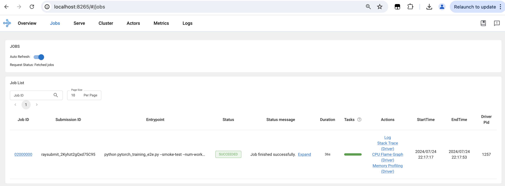

# Ray Cluster

## Description

This module creates a Ray cluster in AWS EKS Kubernetes cluster. It deploys a RayClsuter via [kuberay-helm](https://github.com/ray-project/kuberay-helm) and a ClusterIP service.

## Inputs/Outputs

### Input Parameters

#### Required

- `eks_cluster_name` - Name of the EKS cluster to deploy to
- `eks_cluster_admin_role_arn`- ARN of EKS admin role to authenticate kubectl
- `eks_oidc_arn` - ARN of EKS OIDC provider for IAM roles
- `namespace` - Kubernetes namespace name
- `service_account_name` - Service account name

#### Optional

- `ray_cluster_helm_chart_version` - Kuberay RayCluster helm chart version. Defaults to `1.1.1`.
- `image_uri` - Container Image URI. Defaults to `rayproject/ray-ml:2.23.0`.
- `enable_autoscaling` - Whether ray autoscaler is enabled. `True` by default.
- `autoscaler_idle_timeout_seconds` -  The number of seconds to wait before scaling down a worker pod which is not using Ray resources.
- `head_resources` - Head group resource requests and limits. Defaults to:
```yaml
      requests:
        cpu: "1"
        memory: "8G"
      limits:
        cpu: "1"
        memory: "8G"
```
- `worker_replicas` - The requested number of the Pod replicas in worker group. Defaults to `1`.
- `worker_min_replicas` - The minimum number of the Pod replicas in worker group. Defaults to `1`.
- `worker_max_replicas` - The maximum number of the Pod replicas in worker group. Defaults to `10`.
- `worker_resources` - Worker group resource requests and limits. Defaults to:
```yaml
      requests:
        cpu: "1"
        memory: "8G"
      limits:
        cpu: "1"
        memory: "8G"
```
- `tags` - List of additional tags to apply to all resources

## User Guide

### Submitting Jobs

After deploying the RayOperator and RayCluster modules, follow the steps below to submit a job to the cluster.

1. Connect to EKS cluster
```
aws eks update-kubeconfig --region us-east-1 --name eks-cluster-xxx
```

2. Check that Ray cluster and operator pods are running:

```
kubectl get pods --all-namespaces

NAMESPACE     NAME                                                        READY   STATUS    RESTARTS   AGE
...
ray           kuberay-operator-...                                        1/1     Running   0          11m
ray           ray-cluster-kuberay-head-...                                1/1     Running   0          11m
ray           ray-cluster-kuberay-worker-workergroup-...                  1/1     Running   0          11m
ray           ray-cluster-kuberay-worker-workergroup-...                  1/1     Running   0          11m
```

3. Check Ray service is running:

```
kubectl get services -n ray

NAME               TYPE        CLUSTER-IP       EXTERNAL-IP   PORT(S)                                         AGE
kuberay-head-svc   ClusterIP   ...              <none>        10001/TCP,8265/TCP,8080/TCP,6379/TCP,8000/TCP   64s
kuberay-operator   ClusterIP   ...              <none>        8080/TCP                                        6m3s
```

4. Get Ray service endpoint:

```
kubectl get endpoints -n ray

NAME               ENDPOINTS                                                      AGE
kuberay-head-svc   ...:8080,...:10001,...:8000 + 2 more...                        98s
kuberay-operator   ...:8080                                                       6m37s
```

5. Set up port forwarding:

```
kubectl port-forward -n ray --address 0.0.0.0 service/kuberay-head-svc  8265:8265
```

6. Submit a dummy Ray job:
```
ray job submit --address http://localhost:8265 -- python -c "import ray; ray.init(); print(ray.cluster_resources())"
```

7. For a more elaborate example, get an example pytorch training job from the Ray repository:

```
wget https://raw.githubusercontent.com/ray-project/ray/master/release/air_tests/air_benchmarks/workloads/pytorch_training_e2e.py
```

8. Submit a training job:

```
ray job submit --address http://localhost:8265 --working-dir="." -- python pytorch_training_e2e.py --smoke-test --num-workers 6

```

9. Access the Ray Dashboard at `http://localhost:8265`:



## Sample manifest declaration

```yaml
name: ray-cluster
path: modules/eks/ray-cluster
parameters:
  - name: EksClusterAdminRoleArn
    valueFrom:
      moduleMetadata:
        group: core
        name: eks
        key: EksClusterMasterRoleArn
  - name: EksClusterName
    valueFrom:
      moduleMetadata:
        group: core
        name: eks
        key: EksClusterName
  - name: EksClusterEndpoint
    valueFrom:
      moduleMetadata:
        group: core
        name: eks
        key: EksClusterEndpoint
  - name: EksOidcArn
    valueFrom:
      moduleMetadata:
        group: core
        name: eks
        key: EksOidcArn
  - name: Namespace
    valueFrom:
      parameterValue: rayNamespaceName
  - name: ServiceAccountName
    valueFrom:
      moduleMetadata:
        group: ray-operator
        name: ray-operator
        key: EksServiceAccountName
  - name: HeadResources
    value:
      requests:
        cpu: "1"
        memory: "8G"
      limits:
        cpu: "1"
        memory: "8G"
  - name: WorkerReplicas
    value: 2
  - name: WorkerMinReplicas
    value: 2
  - name: WorkerMaxReplicas
    value: 10
  - name: WorkerResources
    value:
      requests:
        cpu: "4"
        memory: "24G"
      limits:
        cpu: "4"
        memory: "24G"
```
