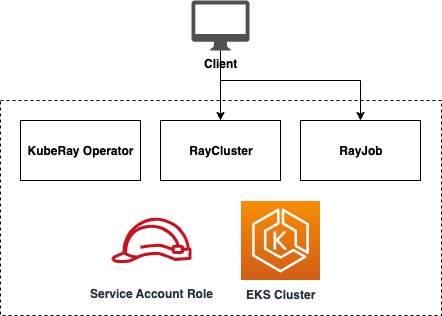

# Ray Operator

## Description

This module runs Ray Operator in AWS EKS Kubernetes cluster. It deploys a KubeRay Operator via [kuberay-helm](https://github.com/ray-project/kuberay-helm).

## High-level Architecture



### Usage

## RayCluster Example

The example leverages [RayCluster](https://docs.ray.io/en/latest/cluster/kubernetes/getting-started/raycluster-quick-start.html).

After deploying the RayCluster, follow the steps below to submit a job to the cluster.

1. Connect to EKS cluster
```
aws eks update-kubeconfig --region us-east-1 --name eks-cluster-xxx
```

2. Check that Ray cluster and operator pods are running:

```
kubectl get pods --all-namespaces

NAMESPACE     NAME                                                        READY   STATUS    RESTARTS   AGE
...
ray           kuberay-operator-...                                        1/1     Running   0          11m
ray           ray-cluster-kuberay-head-...                                1/1     Running   0          11m
ray           ray-cluster-kuberay-worker-workergroup-...                  1/1     Running   0          11m
ray           ray-cluster-kuberay-worker-workergroup-...                  1/1     Running   0          11m
```

3. Set up port forwarding:

```
kubectl port-forward -n ray --address 0.0.0.0 ray-cluster-kuberay-head-...  8265:8265
```

4. Submit a Ray job:
```
ray job submit --address http://localhost:8265 -- python -c "import ray; ray.init(); print(ray.cluster_resources())"
```

## Inputs/Outputs

### Input Parameters

#### Required

- `eks_cluster_name` - Name of the EKS cluster to deploy to
- `eks_cluster_admin_role_arn`- ARN of EKS admin role to authenticate kubectl
- `eks_oidc_arn` - ARN of EKS OIDC provider for IAM roles
- `eks_openid_issuer` - OIDC issuer
- `eks_cluster_endpoint` - EKS cluster endpoint
- `eks_cert_auth_data` - Auth certificate
- `namespace` - Kubernetes namespace name

#### Optional

- `tags` - List of additional tags to apply to all resources

### Sample manifest declaration

```yaml
name: ray-on-eks
path: modules/eks/ray-on-eks
parameters:
  - name: EksClusterAdminRoleArn
    valueFrom:
      moduleMetadata:
        group: core
        name: eks
        key: EksClusterMasterRoleArn
  - name: EksClusterName
    valueFrom:
      moduleMetadata:
        group: core
        name: eks
        key: EksClusterName
  - name: EksClusterEndpoint
    valueFrom:
      moduleMetadata:
        group: core
        name: eks
        key: EksClusterEndpoint
  - name: EksOidcArn
    valueFrom:
      moduleMetadata:
        group: core
        name: eks
        key: EksOidcArn
  - name: EksOpenidIssuer
    valueFrom:
      moduleMetadata:
        group: core
        name: eks
        key: EksClusterOpenIdConnectIssuer
  - name: EksCertAuthData
    valueFrom:
      moduleMetadata:
        group: core
        name: eks
        key: EksClusterCertAuthData
  - name: EksClusterSecurityGroupId
    valueFrom:
      moduleMetadata:
        group: core
        name: eks
        key: EksClusterSecurityGroupId
  - name: Namespace
    valueFrom:
      parameterValue: rayNamespaceName
```

### Module Metadata Outputs

- `EksServiceAccountName`: Service Account Name.
- `EksServiceAccountRoleArn`: Service Account Role ARN.
- `NamespaceName`: Name of the namespace.

