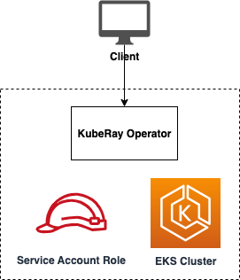

# Ray Operator

## Description

This module runs Ray Operator in AWS EKS Kubernetes cluster. It deploys a KubeRay Operator via [kuberay-helm](https://github.com/ray-project/kuberay-helm).

## High-level Architecture



## Inputs/Outputs

### Input Parameters

#### Required

- `eks_cluster_name` - Name of the EKS cluster to deploy to
- `eks_cluster_admin_role_arn`- ARN of EKS admin role to authenticate kubectl
- `eks_oidc_arn` - ARN of EKS OIDC provider for IAM roles
- `eks_openid_issuer` - OIDC issuer
- `eks_cluster_endpoint` - EKS cluster endpoint
- `eks_cert_auth_data` - Auth certificate
- `namespace` - Kubernetes namespace name

#### Optional

- `tags` - List of additional tags to apply to all resources

### Sample manifest declaration

```yaml
name: ray-on-eks
path: modules/eks/ray-on-eks
parameters:
  - name: EksClusterAdminRoleArn
    valueFrom:
      moduleMetadata:
        group: core
        name: eks
        key: EksClusterMasterRoleArn
  - name: EksClusterName
    valueFrom:
      moduleMetadata:
        group: core
        name: eks
        key: EksClusterName
  - name: EksClusterEndpoint
    valueFrom:
      moduleMetadata:
        group: core
        name: eks
        key: EksClusterEndpoint
  - name: EksOidcArn
    valueFrom:
      moduleMetadata:
        group: core
        name: eks
        key: EksOidcArn
  - name: EksOpenidIssuer
    valueFrom:
      moduleMetadata:
        group: core
        name: eks
        key: EksClusterOpenIdConnectIssuer
  - name: EksCertAuthData
    valueFrom:
      moduleMetadata:
        group: core
        name: eks
        key: EksClusterCertAuthData
  - name: EksClusterSecurityGroupId
    valueFrom:
      moduleMetadata:
        group: core
        name: eks
        key: EksClusterSecurityGroupId
  - name: Namespace
    valueFrom:
      parameterValue: rayNamespaceName
```

### Module Metadata Outputs

- `EksServiceAccountName`: Service Account Name.
- `EksServiceAccountRoleArn`: Service Account Role ARN.
- `NamespaceName`: Name of the namespace.

