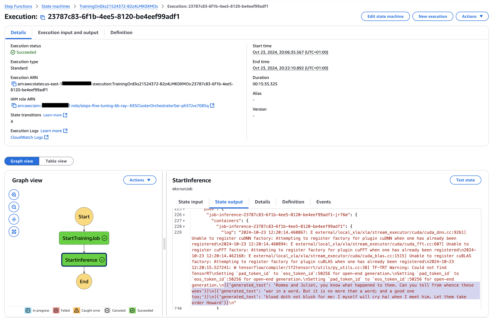

# Ray Orchestrator

## Description

This module orchestrates submission of a training job to the Ray Cluster using AWS Step Functions.

## Inputs/Outputs

### Input Parameters

#### Required

- `namespace` - Kubernetes namespace name
- `eks_cluster_admin_role_arn`- ARN of EKS admin role to authenticate kubectl
- `eks_handler_role_arn`- ARN of EKS admin role to authenticate kubectl
- `eks_cluster_name` - Name of the EKS cluster to deploy to
- `eks_cluster_endpoint` - EKS cluster endpoint
- `eks_oidc_arn` - ARN of EKS OIDC provider for IAM roles
- `eks_cert_auth_data` - Auth certificate

#### Optional

- `step_function_timeout` - Step function timeout in minutes. Defaults to `360`
- `data_bucket_name` - Name of the bucket to grant service account permissions to
- `tags` - A dictionary of additional tags to apply to all resources. Defaults to None

## User Guide

### Submitting Jobs using Step Functions

1. Navigate to AWS Step Functions and find step function starting with "TrainingOnEks"
2. Start a new Step Function execution



To observe the progress of the job using Ray Dashboard,

1. Connect to EKS cluster
```
aws eks update-kubeconfig --region us-east-1 --name eks-cluster-xxx
```

2. Get Ray service endpoint:

```
kubectl get endpoints -n ray

NAME               ENDPOINTS                                                      AGE
kuberay-head-svc   ...:8080,...:10001,...:8000 + 2 more...                        98s
kuberay-operator   ...:8080                                                       6m37s
```

3. Start port forwarding:

```
kubectl port-forward -n ray --address 0.0.0.0 service/kuberay-head-svc  8265:8265
```

4. Access the Ray Dashboard at `http://localhost:8265`:


## Sample manifest declaration

```yaml
name: ray-orchestrator
path: modules/eks/ray-orchestrator
parameters:
  - name: Namespace
    valueFrom:
      parameterValue: rayNamespaceName
  - name: EksClusterAdminRoleArn
    valueFrom:
      moduleMetadata:
        group: core
        name: eks
        key: EksClusterMasterRoleArn
  - name: EksHandlerRoleArn
    valueFrom:
      moduleMetadata:
        group: core
        name: eks
        key: EksHandlerRoleArn
  - name: EksClusterName
    valueFrom:
      moduleMetadata:
        group: core
        name: eks
        key: EksClusterName
  - name: EksClusterEndpoint
    valueFrom:
      moduleMetadata:
        group: core
        name: eks
        key: EksClusterEndpoint
  - name: EksOidcArn
    valueFrom:
      moduleMetadata:
        group: core
        name: eks
        key: EksOidcArn
  - name: EksCertAuthData
    valueFrom:
      moduleMetadata:
        group: core
        name: eks
        key: EksClusterCertAuthData
  - name: DataBucketName
    valueFrom:
      moduleMetadata:
        group: base
        name: buckets
        key: ArtifactsBucketName
```

## Module Metadata Outputs

- `EksServiceAccountName`: Service Account Name.
- `EksServiceAccountRoleArn`: Service Account Role ARN.
- `StateMachineArn`: Step Function ARN.
- `LogGroupArn`: log group ARN.
