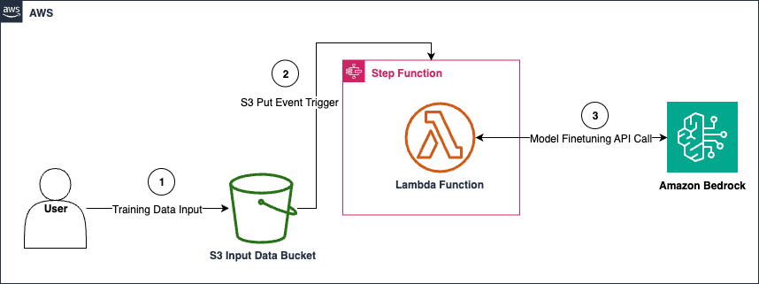

## Introduction

This module presents how you can setup automated model finetuning in Amazon Bedrock.

## Description

The module creates a finetuning job for Amazon Bedrock model of choice (you provide the model's name in input, note that not all models on Amazon Bedrock can be finetuned currently). Finetuning is triggered by dropping new file into created S3 Bucket. This triggers step function execution that using Lambda invokes the finetuning job and provides all the necessary parameters. You can expand this solution by adding more steps to the step function or by adding other modules.

## Architecture



### Input Parameters

#### Required

- `bedrock-base-model-ID` - ID of the Bedrock model

#### Optional

- `vpc-id` - VPC id
- `subnet-ids` - VPC subnet ids
- `bucket-name` - bucket name to be used as source for input data
- `removal-policy`: the retention policy for the S3 bucket (if one is created)
  - defaults to `RETAIN`
  - supports `DESTROY` and `RETAIN` only

#### Input Example

Example manifest:

```yaml
name: bedrock-finetuning
path: modules/fmops/bedrock-finetuning
targetAccount: primary
parameters:
  - name: bedrock-base-model-ID
    value: amazon.titan-text-express-v1
  - name: bucket-name
    value: sample_bucket_name
  - name: vpc_id
    valueFrom:
      moduleMetadata:
        group: networking
        name: networking
        key: VpcId
  - name: subnet_ids
    valueFrom:
      moduleMetadata:
        group: networking
        name: networking
        key: PrivateSubnetIds
```
