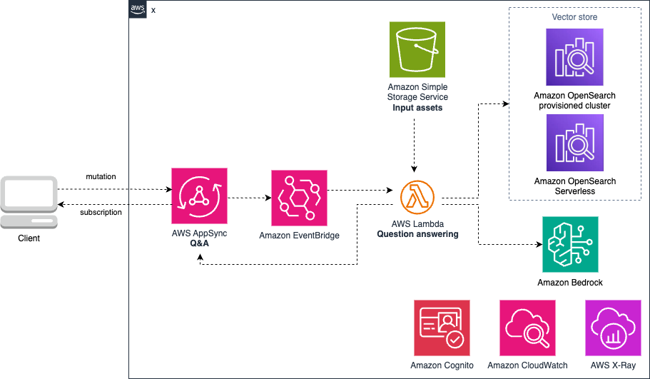

# AppSync endpoint for Question and Answering using RAG

## Description

Deploys an AWS AppSync endpoint for a Question and Answering model using RAG 

The module uses [AWS Generative AI CDK Constructs](https://github.com/awslabs/generative-ai-cdk-constructs/tree/main).

### Architecture



## Inputs/Outputs

### Input Parameters

#### Required

- `cognito-pool-id` - ID of the cognito user pool, used to secure GraphQl API
- `os-domain-endpoint` - Open Search doamin url used as knowledge base

#### Optional

- `vpc-id` - VPC id

### Module Metadata Outputs

- `GraphqlApiId` - Graphql API ID.
- `GraphqlArn` - Graphql API ARN.

## Examples

Example manifest:

```yaml
name: qna-rag
path: modules/fmops/qna-rag
parameters:
  - name: cognito-pool-id
    value: us-east-1_XXXXX
  - name: os-domain-endpoint
    valueFrom:
      moduleMetadata:
        group: storage
        name: opensearch
        key: OpenSearchDomainEndpoint
  - name: vpc-id
    valueFrom:
      moduleMetadata:
        group: networking
        name: networking
        key: VpcId
```
