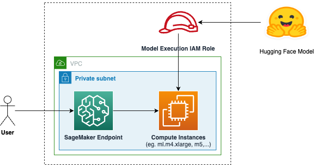

# SageMaker Hugging Face Foundation Model Endpoint

## Description

Deploys an endpoint for a foundation model supported by [Hugging Face LLM Inference Containers for Amazon SageMaker](https://huggingface.co/blog/sagemaker-huggingface-llm).

The module uses [AWS Generative AI CDK Constructs](https://github.com/awslabs/generative-ai-cdk-constructs/tree/main).

### Architecture



## Inputs/Outputs

### Input Parameters

#### Required

- `hugging-face-model-id` - ID of the Hugging Face model
- `instance-type` - inference container instance type
- `deep-learning-container-image` - container image repository and tag

#### Optional

- `vpc-id` - VPC id
- `subnet-ids` - VPC subnet ids
- `hugging-face-token-secret-name` - ID of the AWS secret with the Hugging Face access token

### Module Metadata Outputs

- `EndpointArn` - endpoint ARN.
- `RoleArn` - IAM role ARN.

## Examples

Example manifest:

```yaml
name: hugging-face-mistral-endpoint
path: modules/fmops/sagemaker-hugging-face-endpoint
targetAccount: primary
parameters:
  - name: hugging-face-model-id
    value: mistralai/Mistral-7B-Instruct-v0.1
  - name: instance-type
    value: ml.g5.2xlarge
  - name: deep-learning-container-image
    value: huggingface-pytorch-tgi-inference:2.0.1-tgi1.1.0-gpu-py39-cu118-ubuntu20.04
  - name: vpc_id
    valueFrom:
      moduleMetadata:
        group: networking
        name: networking
        key: VpcId
  - name: subnet_ids
    valueFrom:
      moduleMetadata:
        group: networking
        name: networking
        key: PrivateSubnetIds
```
