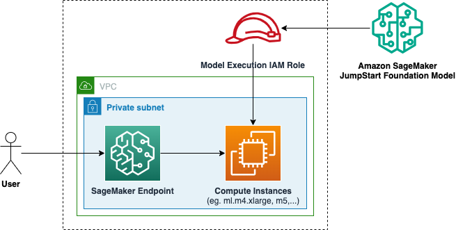

# SageMaker JumpStart Foundation Model Endpoint

## Description

Deploys an endpoint for a foundation model from [SageMaker JumpStart Foundation Models](https://docs.aws.amazon.com/sagemaker/latest/dg/jumpstart-foundation-models.html).

The module uses [AWS Generative AI CDK Constructs](https://github.com/awslabs/generative-ai-cdk-constructs/tree/main).

### Architecture



## Inputs/Outputs

### Input Parameters

#### Required

- `jump-start-model-name` - model name from SageMaker JumpStart Foundation Models
- `instance-type` - inference container instance type

#### Optional

- `vpc-id` - VPC id
- `subnet-ids` - VPC subnet ids
- `endpoint-name` - name of te endpoint. `{project}-{deloyment}-{module}` by default.
- `permissions-boundary-name`: IAM Policy Name to attach to all roles as permissions boundary. Empty by default.

### Module Metadata Outputs

- `EndpointArn` - endpoint ARN.
- `RoleArn` - IAM role ARN.

## Examples

Example manifest:

```yaml
name: hf-mistral-endpoint
path: modules/fmops/sagemaker-jumpstart-fm-endpoint
targetAccount: primary
parameters:
  - name: jump-start-model-name
    value: HUGGINGFACE_LLM_MISTRAL_7B_2_1_0
  - name: instance-type
    value: inf1.xlarge
  - name: vpc_id
    valueFrom:
      moduleMetadata:
        group: networking
        name: networking
        key: VpcId
  - name: subnet_ids
    valueFrom:
      moduleMetadata:
        group: networking
        name: networking
        key: PrivateSubnetIds
```
