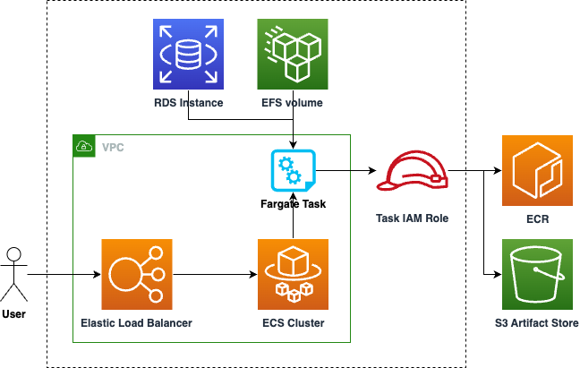

# Mlflow on Fargate module

## Description

This module runs Mlflow on AWS Fargate.

By default, uses EFS for backend storage. Optionally, an RDS instance can be used for storage.

### Architecture



## Inputs/Outputs

### Input Parameters

#### Required

- `vpc-id`: The VPC-ID that the ECS cluster will be created in.
- `subnet-ids`: The subnets that the Fargate task will use.
- `ecr-repository-name`: The name of the ECR repository to pull the image from.
- `artifacts-bucket-name`: Name of the artifacts store bucket

#### Optional

- `ecs-cluster-name`: Name of the ECS cluster.
- `service-name`: Name of the service.
- `task-cpu-units`: The number of cpu units used by the Fargate task.
- `task-memory-limit-mb`: The amount (in MiB) of memory used by the Fargate task.
- `lb-access-logs-bucket-name`: Name of the bucket to store load balancer access logs
- `lb-access-logs-bucket-prefix`: Prefix for load balancer access logs
- `rds-hostname`: Endpoint address of the RDS instance
- `rds-port`: Port of the RDS instance
- `rds-credentials-secret-arn`: RDS database credentials stored in SecretsManager
- `rds-security-group-id`: Security group of the RDS instance
  - needed so that an inbound rule can be created to grant Fargate access to the database

### Sample manifest declaration

```yaml
name: mlflow-fargate
path: modules/mlflow/mlflow-fargate
parameters:
  - name: vpc-id
    valueFrom:
      moduleMetadata:
        group: networking
        name: networking
        key: VpcId
  - name: subnet-ids
    valueFrom:
      moduleMetadata:
        group: networking
        name: networking
        key: PrivateSubnetIds
  - name: ecr-repository-name
    valueFrom:
      moduleMetadata:
        group: storage
        name: ecr-mlflow
        key: EcrRepositoryName
  - name: artifacts-bucket-name
    valueFrom:
      moduleMetadata:
        group: storage
        name: buckets
        key: ArtifactsBucketName
  - name: rds-hostname
    valueFrom:
      moduleMetadata:
        group: database
        name: mlflow-mysql
        key: DatabaseHostname
  - name: rds-credentials-secret-arn
    valueFrom:
      moduleMetadata:
        group: database
        name: mlflow-mysql
        key: CredentialsSecretArn
```

### Module Metadata Outputs

- `ECSClusterName`: Name of the ECS cluster.
- `ServiceName`: Name of the service.
- `LoadBalancerDNSName`: Load balancer DNS name.
- `LoadBalancerAccessLogsBucketArn`: Load balancer access logs bucket arn
- `EFSFileSystemId`: EFS file system id.

#### Output Example

```
{
  "ECSClusterName": "mlops-mlops-mlflow-mlflow-fargate-EcsCluster97242B84-xxxxxxxxxxxx",
  "ServiceName": "mlops-mlops-mlflow-mlflow-fargate-MlflowLBServiceEBACC043-xxxxxxxxxxxx",
  "LoadBalancerDNSName": "xxxxxxxxxxxx.elb.us-east-1.amazonaws.com",
  "LoadBalancerAccessLogsBucketArn": "arn:aws:s3:::xxxxxxxxxxxx",
  "EFSFileSystemId": "fs-xxxxxxxxxxx",
}
```
