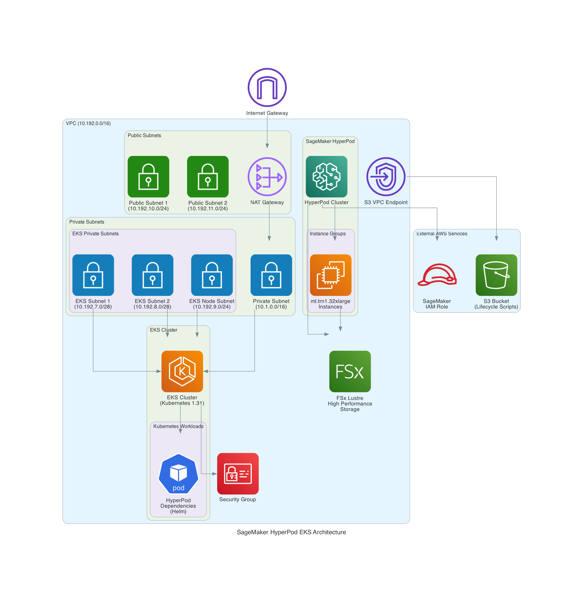

# Amazon SageMaker HyperPod Cluster Module

## Description

This module creates a complete Amazon SageMaker HyperPod cluster infrastructure orchestrated by Amazon EKS. It deploys networking components, EKS cluster, HyperPod cluster, and supporting resources including FSx Lustre for high-performance storage.

## Architecture



The architecture includes:
- **VPC with public and private subnets** for network isolation
- **Amazon EKS cluster** for container orchestration
- **SageMaker HyperPod cluster** with ML compute instances
- **FSx Lustre** for high-performance shared storage
- **S3 bucket** for lifecycle scripts and data
- **IAM roles** for secure service access

## Inputs/Outputs

### Input Parameters

- `availability_zone_id` - The Availability Zone Id for private subnet (e.g., `use1-az2`, `usw2-az1`). WARNING: must match your training plan availability zone if using training plans
- `resource_name_prefix` - Prefix to be used for all resources.
- `hyperpod_cluster_name` - Name of the HyperPod cluster.
- `eks_cluster_name` - The name of the EKS cluster.
- `instance_groups` - Map of instance group configurations with the following structure:
```yaml
instance_groups = {
  instance-group-1 = {
    instance_type             = "ml.g5.8xlarge"
    instance_count            = 8
    ebs_volume_size           = 100
    threads_per_core          = 2
    enable_stress_check       = true
    enable_connectivity_check = true
    lifecycle_script          = "on_create.sh"
    training_plan_arn         = "" # optional
  }
}
```

## User Guide

### Accessing the Cluster

1. Update your kubeconfig to access the EKS cluster:
```bash
aws eks update-kubeconfig --region <region> --name <cluster-name>
```

2. Verify the HyperPod cluster status:
```bash
kubectl get pods -n kube-system
```

3. Check HyperPod cluster status via AWS CLI:
```bash
aws sagemaker describe-cluster --cluster-name <hyperpod-cluster-name>
```

### Running Training Jobs

1. Connect to a cluster node via SSH or use the SageMaker HyperPod CLI
2. Submit training jobs using the HyperPod job submission interface
3. Monitor job progress through the SageMaker console or CLI

## Sample manifest declaration

```yaml
name: sagemaker-hyperpod-eks
path: modules/sagemaker/hyperpod-eks-tf
parameters:
  - name: AvailabilityZoneId
    value: "use1-az2"
  - name: ResourceNamePrefix
    value: "ml-training-"
  - name: InstanceGroups
    value:
      instance-group-1:
        instance_type: "ml.g5.8xlarge"
        instance_count: 8
        ebs_volume_size: 100
        threads_per_core: 2
        enable_stress_check: true
        enable_connectivity_check: true
        lifecycle_script: "on_create.sh"
  - name: HyperpodClusterName
    value: "ml-training-cluster"
  - name: EksClusterName
    value: "ml-training-eks-cluster"
```
