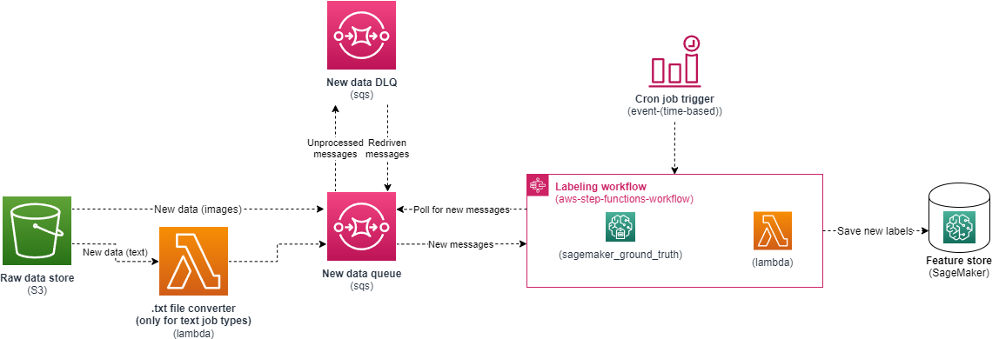
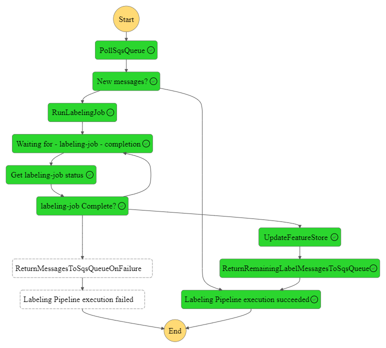
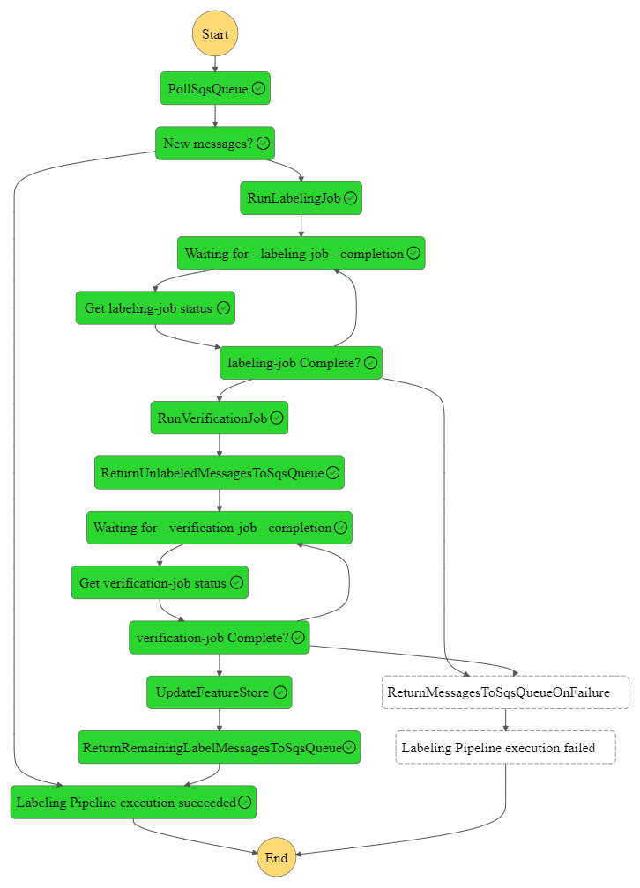

# SageMaker Ground truth labeling

## Description

This module creates a workflow for labeling data using SageMaker ground truth.

A bucket is created to store the raw data. Data uploaded to the S3 bucket is then sent to a created SQS queue. If a text job type is selected the contents of `.txt` files uploaded to the bucket is sent to the SQS queue, instead of the file location. A step function is created that runs on a schedule, pulling the unlabeled data from the SQS queue. The function then runs a labeling job, followed by a verification job (only on supported job types, see below) to increase the accuracy of the labeling. Labeled items that fail validation are returned to the SQS queue for relabelling. New labels are then saved to a created Sagemaker feature group.

This module assumes that uploaded content will be free of `Personally Identifiable Information (PII)` and `Adult content`. If this is not the case please remove the appropiate content classifiers from the `create_labeling_job` method.

### Architecture



### Step function example



#### With verification step



## Inputs/Outputs

### Input Parameters

#### Required

- `job-name`: Used as prefix for created resources and executions of workflow
- `task-type`: The labeling task type to be carried out (read more [here](https://docs.aws.amazon.com/sagemaker/latest/dg/sms-task-types.html)). Currently this module supports all built in task types for images and text. 
Allowed values are:
  - [`image_bounding_box`](https://docs.aws.amazon.com/sagemaker/latest/dg/sms-bounding-box.html)
  - [`image_semantic_segmentation`](https://docs.aws.amazon.com/sagemaker/latest/dg/sms-semantic-segmentation.html)
  - [`image_single_label_classification`](https://docs.aws.amazon.com/sagemaker/latest/dg/sms-image-classification.html)
  - [`image_multi_label_classification`](https://docs.aws.amazon.com/sagemaker/latest/dg/sms-image-classification-multilabel.html)
  - [`text_single_label_classification`](https://docs.aws.amazon.com/sagemaker/latest/dg/sms-text-classification.html)
  - [`text_multi_label_classification`](https://docs.aws.amazon.com/sagemaker/latest/dg/sms-text-classification-multilabel.html)
  - [`named_entity_recognition`](https://docs.aws.amazon.com/sagemaker/latest/dg/sms-named-entity-recg.html)
- `labeling-workteam-arn` - ARN of the workteam to carry out the labeling task, can be public or private
  - `labeling-task-price` - Required if public team is to be used
- `labeling-instructions-template-s3-uri` - S3 URI of the labeling template `.html` or `.liquid` file
  - Required for all labeling types _except_ `named_entity_recognition`
- `labeling-categories-s3-uri` - S3 URI of the labeling categories `.json` file
- `labeling-task-title`
- `labeling-task-description`
- `labeling-task-keywords`

For job types supporting verification, currently `image_bounding_box` and `image_semantic_segmentation` further additional fields are required

- `verification-workteam-arn` - ARN of the workteam to carry out the verification task, can be public or private
  - `verification-task-price` - Required if public team is to be used
- `verification-instructions-template-s3-uri` - S3 URI of the verification template `.html` or `.liquid` file
- `verification-categories-s3-uri` - S3 URI of the verification categories `.json` file. The first label must be the label to pass validation, all other labels are validation failures.
- `verification-task-title`
- `verification-task-description`
- `verification-task-keywords`

For more information and examples of the templates please look at the examples. There are also multiple templates available [here](https://github.com/aws-samples/amazon-sagemaker-ground-truth-task-uis/tree/master).

Labeling and verification task title, description and keywords are used to create the task config which will be sent to the human carrying out the labeling or verification job.

More information on using a public workforce like Amazon Mechanical Turk is available [here](https://docs.aws.amazon.com/sagemaker/latest/dg/sms-workforce-management-public.html). Labeling and verification task prices is specified in USD, see [here](https://docs.aws.amazon.com/sagemaker/latest/APIReference/API_PublicWorkforceTaskPrice.html) for allowed values. [This page](https://aws.amazon.com/sagemaker/groundtruth/pricing/) provides suggested pricing based on task type.

#### Optional

- `labeling-human-task-config`: Additional configuration parameters for labeling job. For tasks without a verification step we recommend increasing the number of human workers per data object, to increase accuracy. Depending on task complexity you might want to increase the task time limit. Default is:
  - `NumberOfHumanWorkersPerDataObject`: 1
  - `TaskAvailabilityLifetimeInSeconds`: 21600 (6 hours)
  - `TaskTimeLimitInSeconds`: 300 (5 minutes)
- `verification-human-task-config`: Additional configuration parameters for verification job. Default is:
  - `NumberOfHumanWorkersPerDataObject`: 1
  - `TaskAvailabilityLifetimeInSeconds`: 21600 (6 hours)
  - `TaskTimeLimitInSeconds`: 300 (5 minutes)
- `labeling-workflow-schedule`: CRON schedule for how often the workflow should run. Default is `cron(0 12 * * ? *)` (midday UTC daily), empty string ('') to disable
- `sqs-queue-retention-period`: Upload queue retention period in minutes. Default is 20160 (14 days) 
- `sqs-queue-visibility-timeout`: Upload queue visibility timeout in minutes. Default is 720 (12 hours)
- `sqs-queue-max-receive-count`: Default is 3
- `sqs-dlq-retention-period`: DLQ retention period in minutes, suggest setting to a high value to ensure they are caught and re-driven before deletion. Default is 20160 (14 days)
- `sqs-dlq-visibility-timeout`: DLQ visibility timeout in minutes. Default is 720 (12 hours)
- `sqs-dlq-alarm-threshold` - Number of messages in the DLQ on which to alarm. Default is 1, 0 to disable

`labeling-workflow-schedule` and the SQS queue parameters should be set to values that ensure the workflow can run at least as many times as the `maxRecieveCount` before the `retentionPeriod` is reached, to avoid messages being deleted upon reaching the `retentionPeriod`, instead of being sent to the DLQ

### Sample manifest declaration

```yaml
name: ground-truth-labeling
path: modules/sagemaker/sagemaker-ground-truth-labeling
parameters:
  - name: job_name
    value: 'plane-identification'
  - name: task_type
    value: 'image_bounding_box'
  - name: labeling-workteam-arn
    value: 'arn:aws:sagemaker:<region>:<account>:workteam/private-crowd/<workteam_name>'
  - name: labeling-instructions-template-s3-uri
    value: 's3://<bucket_name>/<template_name>'
  - name: labeling-categories-s3-uri
    value: 's3://<bucket_name>/<categories_name>'
  - name: labeling-task-title
    value: 'Labeling - Bounding boxes: Draw bounding boxes around all planes in the image'
  - name: labeling-task-description
    value: 'Draw bounding boxes around all planes in the image'
  - name: labeling-task-keywords
    value: [ 'image', 'object', 'detection' ]
  - name: verification-workteam-arn
    value: 'arn:aws:sagemaker:<region>:<account>:workteam/private-crowd/<workteam_name>'
  - name: verification-instructions-template-s3-uri
    value: 's3://<bucket_name>/<template_name>'
  - name: verification-categories-s3-uri
    value: 's3://<bucket_name>/<categories_name>'
  - name: verification-task-title
    value: 'Label verification - Bounding boxes: Review the existing labels on the objects and choose the appropriate option.'
  - name: verification-task-description
    value: 'Verify that the planes are correctly labeled'
  - name: verification-task-keywords
    value: ['image', 'object', 'detection', 'label verification', 'bounding boxes']
```

### Module Metadata Outputs

- `DataStoreBucketName`: Name of the created S3 bucket where the user will upload the raw data
- `DataStoreBucketArn`: ARN of the created S3 bucket where the user will upload the raw data
- `SqsQueueName`: Name of the created SQS queue
- `SqsQueueArn`: ARN of the created SQS queue
- `SqsDlqName`: Name of the created SQS DLQ
- `SqsDlqArn`: ARN of the created SQS DLQ
- `LabelingStateMachineName`: Name of the labeling state machine
- `LabelingStateMachineArn`: ARN of the labeling state machine
- `FeatureGroupName`: Name of the feature group

#### Output Example

```json
{
  "DataStoreBucketName": "aiops-mlops-sagemaker-sagemaker-<job_name>-upload-bucket",
  "DataStoreBucketArn": "arn:aws:s3:::aiops-mlops-sagemaker-sagemaker-<job_name>-upload-bucket",
  "SqsQueueName": "aiops-mlops-sagemaker-sagemaker-ground-truth-ground-truth-<job_name>-upload-queue",
  "SqsQueueArn": "arn:aws:sqs:<region>:<account>:aiops-mlops-sagemaker-sagemaker-ground-truth-ground-truth-<job_name>-upload-queue",
  "SqsDlqName": "aiops-mlops-sagemaker-sagemaker-ground-truth-ground-truth-<job_name>-upload-dlq",
  "SqsDlqArn": "arn:aws:sqs:<region>:<account>:aiops-mlops-sagemaker-sagemaker-ground-truth-ground-truth-<job_name>-upload-dlq",
  "LabelingStateMachineName": "aiops-mlops-sagemaker-sagemaker-ground-truth-ground-truth-<job_name>-state-machine",
  "LabelingStateMachineArn": "arn:aws:states:<region>:<account>:stateMachine:aiops-mlops-sagemaker-sagemaker-ground-truth-ground-truth-<job_name>-state-machine",
  "FeatureGroupName": "aiops-mlops-sagemaker-sagemaker-<job_name>-sagemaker-feature-group"
}
```
