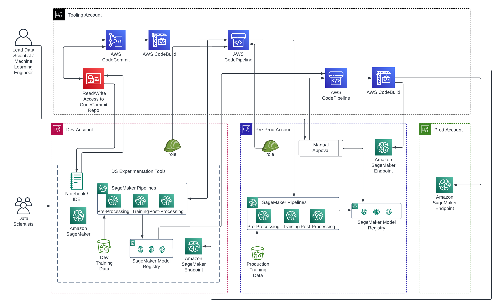

# SageMaker Model CICD

## Description

This module automates the creation of a comprehensive CICD pipeline using AWS CodePipelines, specifically designed for training and deploying SageMaker models. It embraces the Git Flow methodology, enabling model training on various datasets corresponding to different branches. For instance, models trained on the `dev` branch can be deployed to development environments, while those trained on the `main` branch are deployed to production environments.

## Architecture



## Deployment

```bash
seedfarmer apply manifests/mlops-sagemaker-multiacc/deployment.yaml
```

## Inputs/Outputs

### Input Parameters

#### Required

- `infra-repo`: The repository containing the CDK infrastructure code.
- `model-build-repo`: The repository containing the model training code.
- `deployment-groups`: List of deployment groups with source branch, build environment, and deploy environments.

#### Optional

#### Input Example

```yaml
name: sample-ml-model-name
path: modules/sagemaker/sagemaker-model-cicd
targetAccount: tooling
parameters:
  - name: infra-repo
    value:
      host: codecommit
      name: cdk-infra-repo
  - name: model-build-repo
    value:
      host: codecommit
      name: model-build-repo
  - name: deployment-groups
    value:
      # dev deployment group with experimentation on dev dataset
      - name: experimenation-deployment-group
        sourceBranch: dev
        buildEnvironment:
          name: experiment-env1
          account: '123456789012'
          region: us-east-1
          type: dev
        deployEnvironments:
          - name: experiment-env2
            account: '123456789013'
            type: dev
          - name: experiment-env3
            account: '123456789014'
            type: dev
      # prod deployment group with retraining on prod dataset
      - name: prod-deployment-group
        sourceBranch: main
        buildEnvironment:
          name: prod-train-env
          account: '123456789015'
          region: us-east-1
          type: preprod
        deployEnvironments:
          - name: prod-approval-env
            account: '123456789016'
            type: preprod
          - name: prod-env
            account: '123456789017'
            type: prod
```

### Module Metadata Outputs

#### Output Example
