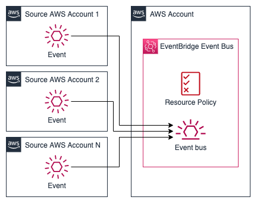

# SageMaker Model Event Bus

## Description

This module creates an Amazon EventBridge Bus for cross-account events.

### Architecture



## Inputs/Outputs

### Input Paramenters

#### Required

- `event_bus_name`: EventBridge Bus name.

#### Optional

- `source_accounts`: A list of account ids which shall have write access to the eventbridge bus. Defaults None.
- `tags`: A dictionary of tags. Defaults None.

### Sample manifest declaration

```yaml
name: sagemaker-model-event-bus
path: modules/sagemaker/sagemaker-model-event-bus/sagemaker_model_event_bus
targetAccount: primary
parameters:
  - name: event_bus_name
    value: mlops-bus
  - name: source_accounts
    value: '["111222333444", "555666777888"]'
  - name: tags
    value: '{"key": "value"}'
```

### Module Metadata Outputs

- `EventBusArn`: the EventBridge bus ARN.
- `EventBusName`: the EventBridge bus name.

#### Output Example

```json
{
  "EventBusArn": "arn:aws:events:xx-xxxx-x:xxxxxxxxxx:event-bus/mlops-bus",
  "EventBusName": "mlops-bus",
}
```


