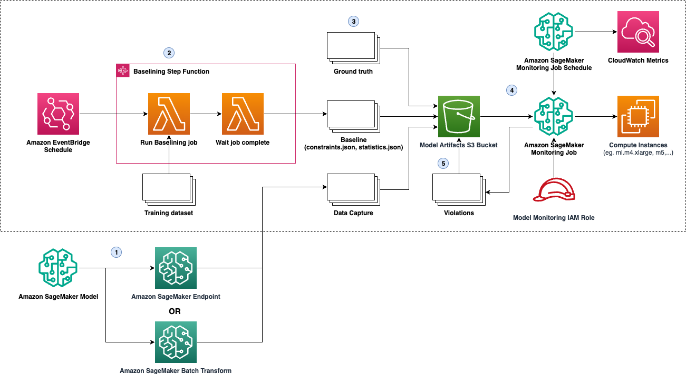

# SageMaker Model Monitoring

## Description

This module creates a SageMaker Model Monitoring job for data quality.
It requires a deployed model endpoint and the proper check steps
for each monitoring job:

* Data Quality: [QualityCheck step](https://docs.aws.amazon.com/sagemaker/latest/dg/build-and-manage-steps.html#step-type-quality-check)
* Model Quality: [QualityCheck step](https://docs.aws.amazon.com/sagemaker/latest/dg/build-and-manage-steps.html#step-type-quality-check)

### Architecture



## Inputs/Outputs

### Input Parameters

#### Required

- `endpoint-name`: The name of the endpoint used to run the monitoring job.
- `security-group-id`: The VPC security group IDs, should provide access to the given `subnet-ids`.
- `subnet-ids`: The ID of the subnets in the VPC to which you want to connect your training job or model.
- `model-package-arn`: Model package ARN
- `model-bucket-arn`: S3 bucket ARN for model artifacts
- `kms-key-id`: The KMS key used to encrypted storage and output.

One or more of:

- `enable-data-quality-monitor`: True to enable the data quality monitoring job.
- `enable-model-quality-monitor`: True to enable the model quality monitoring job.

#### Optional

- `sagemaker-project-id`: SageMaker project id
- `sagemaker-project-name`: SageMaker project name

### Per-job Parameters

Each job has prefixed parameters, some of which are required. E.g. if
`enable-data-quality-monitor` is set to `true`, then the
`data-quality-checkstep-output-prefix` parameter is required.

#### Required

- `*-checkstep-output-prefix`: The S3 prefix in `model-artifacts-bucket-arn` which contains the output from the corresponding [Check step in the SageMaker Pipeline](https://docs.aws.amazon.com/sagemaker/latest/dg/build-and-manage-steps.html#build-and-manage-steps-types).
- `*-output-prefix`: The S3 prefix in `model-artifacts-bucket-arn` to contain the output of the monitoring job.

#### Optional

- `*-instance-count`: The number of ML compute instances to use in the model monitoring job.
- `*-instance-type`: The ML compute instance type for the processing job.
- `*-instance-volume-size-in-gb`: The size of the ML storage volume, in gigabytes, that you want to provision.
- `*-max-runtime-in-seconds`: The maximum length of time, in seconds, the monitoring job can run before it is stopped.
- `*-schedule-expression`: A cron expression that describes details about the monitoring schedule.

#### Job-specific Parameters

See below for the specific input parameters for each model monitoring
job. These parameters are all required.

##### Data Quality Monitoring Job Parameters

N/A

##### Model Quality Monitoring Job Parameters

- `model-quality-problem-type`: The machine learning problem type of the model that the monitoring job monitors.
- `model-quality-inference-attribute`: The attribute of the input data that represents the ground truth label.
- `model-quality-probability-attribute`: In a classification problem, the attribute that represents the class probability.
- `model-quality-probability-threshold-attribute`: The threshold for the class probability to be evaluated as a positive result.

### Sample manifest declaration

```yaml
name: monitoring
path: modules/sagemaker/sagemaker-model-monitoring
parameters:
  - name: sagemaker_project_id
    value: dummy123
  - name: sagemaker_project_name
    value: dummy123
  - name: model_package_arn
    value: arn:aws:sagemaker:<region>:<account>:model-package/<package_name>/1
  - name: model_bucket_arn
    value: arn:aws:s3:::<bucket name>
  - name: enable-data-quality-monitor
    value: True
  - name: data-quality-checkstep-output-prefix
    value: model-training-run-1234/dataqualitycheckstep
  - name: data-quality-output-prefix
    value: model-training-run-1234/monitor/dataqualityoutput
  - name: endpoint_name
    valueFrom:
      moduleMetadata:
        group: endpoints
        name: endpoint
        key: EndpointName
  - name: security_group_id
    valueFrom:
      moduleMetadata:
        group: endpoints
        name: endpoint
        key: SecurityGroupId
  - name: kms_key_id
    valueFrom:
      moduleMetadata:
        group: endpoints
        name: endpoint
        key: KmsKeyId
  - name: subnet_ids
    valueFrom:
      moduleMetadata:
        group: networking
        name: networking
        key: PrivateSubnetIds
```

### Module Metadata Outputs

- `ModelExecutionRoleArn`: SageMaker Model Execution IAM role ARN
- `ModelName`: SageMaker Model name
- `ModelPackageArn`: SageMaker Model package ARN
- `EndpointName`: SageMaker Endpoint name
- `EndpointUrl`: SageMaker Endpoint Url

#### Output Example

N/A
