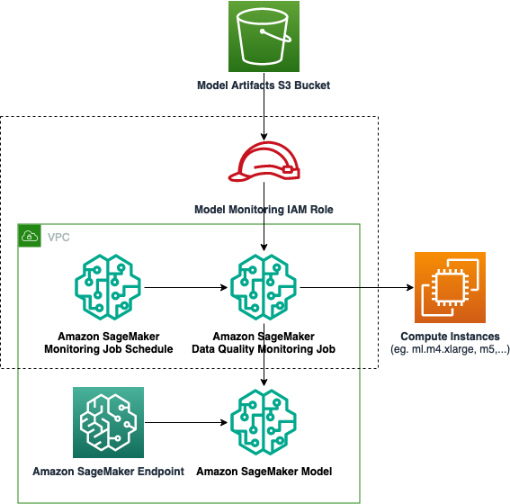

# SageMaker Model Monitoring

## Description

This module creates SageMaker Model Monitoring jobs and monitoring schedules for (optionally) 
data quality, model quality, model bias, and model explainability. It requires a deployed model 
endpoint with data capture enabled.

Available monitoring types:

* Data Quality
* Model Quality
* Model Bias
* Model Explainability

Note that updating parameters will require replacing resources. Deployments may be delayed until any
running monitoring jobs complete (and the resources can be destroyed).

### Architecture



## Inputs/Outputs

### Input Parameters

#### Required

- `endpoint_name`: The name of the endpoint used to run the monitoring job. NOTE: The endpoint must have data capture enabled. Data capture location must be in the bucket provided by `model_bucket_arn` parameter below.
- `model_bucket_arn`: S3 bucket ARN for model, data capture, and monitoring artifacts. Used to provide IAM permissions for monitoring jobs. NOTE: All following S3 URIs must be under this bucket.

One or more of:

- `enable_data_quality_monitor`: True to enable the data quality monitoring job.
- `enable_model_quality_monitor`: True to enable the model quality monitoring job.
- `enable_model_bias_monitor`: True to enable the model bias monitoring job.
- `enable_model_explainability_monitor`: True to enable the model explainability monitoring job.

#### Optional

- `security_group_id`: The VPC security group IDs, should provide access to the given `subnet_ids`.
- `subnet_ids`: The ID of the subnets in the VPC to which you want to connect your training job or model.
- `kms_key_id`: The KMS key used to encrypted storage and output.
- `sagemaker_project_id`: SageMaker project id
- `sagemaker_project_name`: SageMaker project name
- `tags`: Dictionary of tags to apply to resources

### Per-job Parameters

#### Data Quality Monitoring Job Parameters

- `data_quality_baseline_s3_uri`: S3 URI for baseline data quality statistics
- `data_quality_output_s3_uri`: S3 URI for data quality monitoring output
- `data_quality_instance_count`: Number of ML compute instances (default: 1)
- `data_quality_instance_type`: ML compute instance type (default: "ml.m5.large")
- `data_quality_instance_volume_size_in_gb`: Size of ML storage volume in GB (default: 20)
- `data_quality_max_runtime_in_seconds`: Maximum runtime in seconds (default: 3600)
- `data_quality_schedule_expression`: Cron expression for monitoring schedule (default: "cron(0 * ? * * *)")

#### Model Quality Monitoring Job Parameters

- `model_quality_baseline_s3_uri`: S3 URI for baseline model quality statistics
- `model_quality_output_s3_uri`: S3 URI for model quality monitoring output
- `model_quality_ground_truth_s3_uri`: S3 URI for ground truth data
- `model_quality_instance_count`: Number of ML compute instances (default: 1)
- `model_quality_instance_type`: ML compute instance type (default: "ml.m5.large")
- `model_quality_instance_volume_size_in_gb`: Size of ML storage volume in GB (default: 20)
- `model_quality_max_runtime_in_seconds`: Maximum runtime in seconds (default: 1800)
- `model_quality_problem_type`: Machine learning problem type (default: "Regression")
- `model_quality_inference_attribute`: Attribute representing the ground truth label
- `model_quality_probability_attribute`: Attribute representing class probability
- `model_quality_probability_threshold_attribute`: Threshold for class probability evaluation
- `model_quality_schedule_expression`: Cron expression for monitoring schedule (default: "cron(0 * ? * * *)")

#### Model Bias Monitoring Job Parameters

- `model_bias_baseline_s3_uri`: S3 URI for baseline model bias statistics
- `model_bias_output_s3_uri`: S3 URI for model bias monitoring output
- `model_bias_ground_truth_s3_uri`: S3 URI for ground truth data
- `model_bias_instance_count`: Number of ML compute instances (default: 1)
- `model_bias_instance_type`: ML compute instance type (default: "ml.m5.large")
- `model_bias_instance_volume_size_in_gb`: Size of ML storage volume in GB (default: 20)
- `model_bias_max_runtime_in_seconds`: Maximum runtime in seconds (default: 1800)
- `model_bias_features_attribute`: Attributes of input data that are input features
- `model_bias_inference_attribute`: Attribute representing the ground truth label
- `model_bias_probability_attribute`: Attribute representing class probability
- `model_bias_probability_threshold_attribute`: Threshold for class probability evaluation
- `model_bias_schedule_expression`: Cron expression for monitoring schedule (default: "cron(0 * ? * * *)")

#### Model Explainability Monitoring Job Parameters

- `model_explainability_baseline_s3_uri`: S3 URI for baseline model explainability statistics
- `model_explainability_output_s3_uri`: S3 URI for model explainability monitoring output
- `model_explainability_instance_count`: Number of ML compute instances (default: 1)
- `model_explainability_instance_type`: ML compute instance type (default: "ml.m5.large")
- `model_explainability_instance_volume_size_in_gb`: Size of ML storage volume in GB (default: 20)
- `model_explainability_max_runtime_in_seconds`: Maximum runtime in seconds (default: 1800)
- `model_explainability_features_attribute`: Attributes of input data that are input features
- `model_explainability_inference_attribute`: Attribute representing the ground truth label
- `model_explainability_probability_attribute`: Attribute representing class probability
- `model_explainability_schedule_expression`: Cron expression for monitoring schedule (default: "cron(0 * ? * * *)")

### Sample manifest declaration

```yaml
name: monitoring
path: modules/sagemaker/sagemaker-model-monitoring
parameters:
  - name: sagemaker_project_id
    value: SF-DEMO-xgb-churn-pred-model-monitor-2025-10-23-19-11-16
  - name: sagemaker_project_name
    value: SF-DEMO-xgb-churn-pred-model-monitor-2025-10-23-19-11-16
  - name: model_bucket_arn
    value: arn:aws:s3:::sagemaker-us-east-2-<REDACTED>
  - name: endpoint_name
    value: DEMO-xgb-churn-pred-model-monitor-2025-10-23-19-11-16
  - name: enable_data_quality_monitor
    value: true
  - name: data-quality-schedule-expression
    value: cron(0 * ? * * *)
  - name: data_quality_baseline_s3_uri
    value: s3://sagemaker-us-east-2-<REDACTED>/SF-DEMO-xgb-churn-pred-model-monitor/baseline
  - name: data_quality_output_s3_uri
    value: s3://sagemaker-us-east-2-<REDACTED>/SF-DEMO-xgb-churn-pred-model-monitor/output

```
