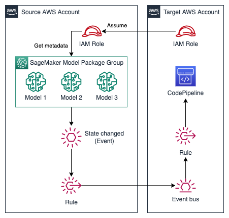

# SageMaker Model Package Event

## Description

This module creates a SageMaker Model Package Event Rule to send SageMaker Model Package Group state changes events to another EventBus and creates an IAM Role that can be assumed to get model package group metadata.

It is usefull when you want to setup cross account integration with SageMaker model package groups.

### Architecture



## Inputs/Outputs

### Input Paramenters

#### Required

- `target_event_bus_name`: The event bus name in the target account to send events to (e.g. default).
- `target_account_id`: The target account id which shall receive events and must have access to model package group metadata (e.g. 11112222333344).
- `model_package_group_name`: SageMaker Package Group Name to setup event rules.

#### Optional

- `sagemaker_project_id`: SageMaker project ID.
- `sagemaker_project_name`: SageMaker project name.

### Sample manifest declaration

```yaml
name: sagemaker-model-package-event
path: modules/sagemaker/sagemaker-model-package-event
targetAccount: primary
parameters:
  - name: model_package_group_name
    value: mlops-model-xgboost
  - name: target_account_id
    value: 111222333444
  - name: target_event_bus_name
    value: default
```

### Module Metadata Outputs

- `RoleArn`: the IAM Role ARN to get model package group metadata.
- `RuleArn`: the EventBridge rule ARN.

#### Output Example

```json
{
  "RoleArn": "arn:aws:iam::111222333444:role/service-role/xxxxxxxxxx",
  "RuleArn": "arn:aws:events:xxxxxxxx:111222333444:rule/xxxxxxxxxxx",
}
```
