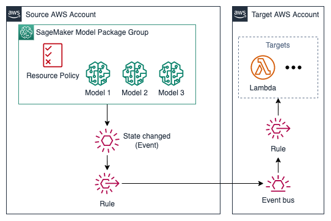

# SageMaker Model Package Group

## Description

This module creates a SageMaker Model Package Group to register and version SageMaker Machine Learning (ML) models and setups an Amazon EventBridge Rule to send model package group state change events to an Amazon EventBridge Bus.

### Architecture



## Inputs/Outputs

### Input Paramenters

#### Required

- `model_package_group_name`: SageMaker Package Group Name to setup event rules.

#### Optional

- `retain_on_delete`: Whether or not to retain resources on delete. Default True.
- `target_event_bus_arn`: The event bus arn in to send events model package group state change events to. It can be a bus located in another account. Defaults None.
- `model_package_group_description`: The model package group description. Default None.
- `target_account_ids`: A list of account ids which shall have read-only access to the model package group. Defaults None.
- `sagemaker_project_id`: SageMaker project ID.
- `sagemaker_project_name`: SageMaker project name.

### Sample manifest declaration

```yaml
name: sagemaker-model-package-group
path: modules/sagemaker/sagemaker-model-package-group
targetAccount: primary
parameters:
  - name: model_package_group_name
    value: mlops-model-xgboost
  - name: retain_on_delete
    value: True
  - name: target_event_bus_arn
    value: arn:aws:events:xx-xxxxx-xx:xxxxxxxxxxxx:event-bus/default
  - name: model_package_group_description
    value: Test model package group module
  - name: target_account_ids
    value: '["111222333444", "555666777888"]'
  - name: sagemaker_project_id
    value: xxxxxxxx
  - name: sagemaker_project_name
    value: test
```

### Module Metadata Outputs

- `SagemakerModelPackageGroupArn`: the SageMaker Model Package Group ARN.
- `SagemakerModelPackageGroupName`: the SageMaker Model Package Group name.

#### Optional Outputs

- `SagemakerModelPackageGroupEventRuleArn`: the Amazon EventBridge rule ARN.

#### Output Example

```json
{
  "SagemakerModelPackageGroupArn": "arn:aws:sagemaker:xx-xxxx-xx:xxxxxxxxxxxxxx:model-package-group/my-package-group",
  "SagemakerModelPackageGroupName": "my-package-group",
  "SagemakerModelPackageGroupEventRuleArn": "arn:aws:events:xxxxxxxx:111222333444:rule/xxxxxxxxxxx",
}
```
