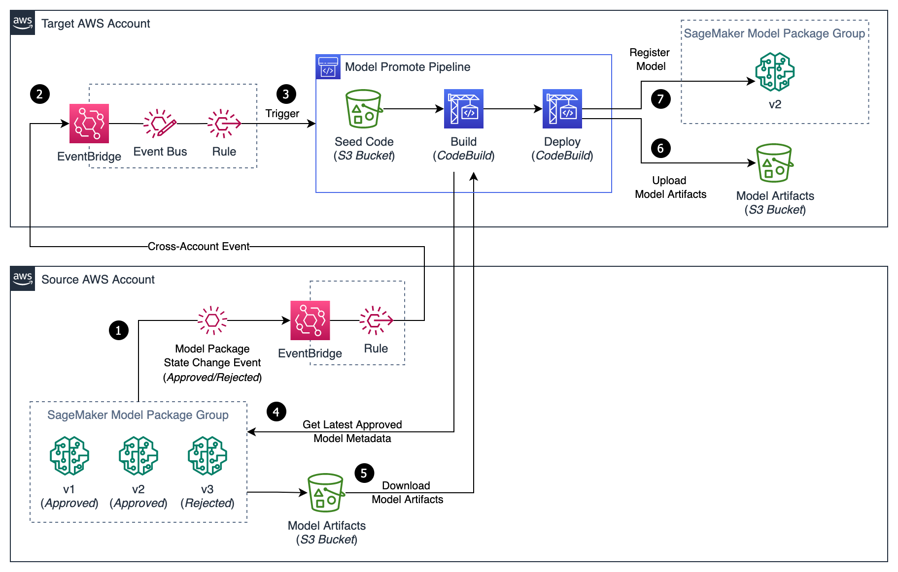

# SageMaker Model Package Promote Pipeline Module

## Description

A Seedfarmer module to deploy a Pipeline to promote SageMaker Model Packages in a multi-account setup. The pipeline can be triggered through an EventBridge rule in reaction of a SageMaker Model Package Group state event change (Approved/Rejected). Once the pipeline is triggered, it will promote the latest approved model package, if one is found.

### Architecture



## Inputs/Outputs

### Input Parameters

#### Required

- `source_model_package_group_arn`: The SageMaker Model Package Group ARN to get the latest approved model package. The model package can be in another account (Source AWS Account).
- `target_bucket_name`: The S3 bucket name in the target account (Target AWS Account) to store model artifacts.

#### Optional

- `event_bus_name`: The event bus name to listen for sagemaker model package group state changes and trigger the pipeline on Approved and Rejected states. Defaults None. The event bus must be in the target account.
- `target_model_package_group_name`: The target model package group name to register the model package being promoted, optional. Defaults None. If None, the target model package group name will be the same as the source model package group name.
- `sagemaker_project_id`: The SageMaker project id to associate with the model package group.
- `sagemaker_project_name`: The SageMaker project name to associate with the model package group.
- `kms_key_arn`: The KMS Key ARN to encrypt model artifacts.
- `retain_on_delete`: Whether to retain model package resources on delete. Defaults True. This applies only to the sagemaker model package resources and not to the resources in this stack.
- `permissions-boundary-name`: IAM Policy Name to attach to all roles as permissions boundary. Empty by default.

### Sample manifest declaration

```yaml
name: promote-test
path: modules/sagemaker/sagemaker-model-package-promote-pipeline
targetAccount: tooling
parameters:
  - name: source_model_package_group_arn
    value: arn:aws:sagemaker:xx-xxxx-x:444333666777:model-package-group/my-model-pkg
  - name: target_bucket_name
    value: mlops-unified-modelartifacts-111222333444-xx-xxxx-x
  - name: permissions-boundary-name
    value: my-permissions-boundary
```

### Module Metadata Outputs

- `PipelineArn`: the CodePipeline ARN.
- `PipelineName`: the CodePipeline name.

#### Optional Outputs

- `EventRuleArn`: the Amazon EventBridge rule ARN.
- `EventRuleName`: the Amazon EventBridge rule Name.

#### Output Example

```json
{
    "PipelineArn":"arn:aws:codepipeline:xx-xxxx-x:1112223334444:mlops-model-package-Pipeline",
    "PipelineName":"mlops-model-package-Pipeline",
    "EventRuleArn":"arn:aws:events:xx-xxxx-x:1112223334444:rule/mlops-bus/mlops-SageMakerModelPackageStat-asdasdx12",
    "EventRuleName":"mlops-bus|mlops-SageMakerModelPackageStat-asdasdx12"
}
```
