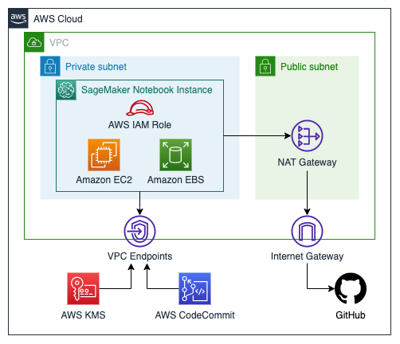

# SageMaker Notebook Instance

## Description

This module creates a SageMaker Notebook instance.

### Architecture



## Inputs/Outputs

### Input Paramenters

#### Required

- `notebook_name`: The name of the new notebook instance
- `instance_type`: The type of ML compute instance to launch for the notebook instance

#### Optional

- `direct_internet_access`: Sets whether SageMaker provides internet access to the notebook instance, by default None
- `root_access`: Whether root access is enabled or disabled for users of the notebook instance, by default None
- `volume_size_in_gb`: The size, in GB, of the ML storage volume to attach to the notebook instance, by default None
- `imds_version`: The Instance Metadata Service (IMDS) version, by default None
- `subnet_ids`: A list of subnet IDs in a VPC to which you would like to have a connectivity, by default None. Only the first subnet id will be used.
- `vpc_id`: The ID of the VPC to which you would like to have a connectivity, by default None
- `kms_key_arn`: The ARN of a AWS KMS key that SageMaker uses to encrypt data on the storage volume attached, by default None
- `code_repository`: The Git repository associated with the notebook instance as its default code repository, by default None
- `additional_code_repositories`: An array of up to three Git repositories associated with the notebook instance, by default None
- `role_arn`: An IAM Role ARN that SageMaker assumes to perform tasks on your behalf, by default None
- `tags`: Extra tags to apply to the SageMaker notebook instance, by default None

### Sample manifest declaration

```yaml
name: notebook
path: modules/sagemaker/sagemaker-notebook
targetAccount: primary
parameters:
  - name: notebook_name
    value: dummy123
  - name: instance_type
    value: ml.t2.xlarge
```

### Module Metadata Outputs

- `SageMakerNotebookArn`: the SageMaker Notebook instance ARN.

#### Output Example

```json
{
  "SageMakerNotebookArn": "arn:aws:sagemaker:xxxxxxx:123412341234:notebook-instance/xxxxx",
}
```
