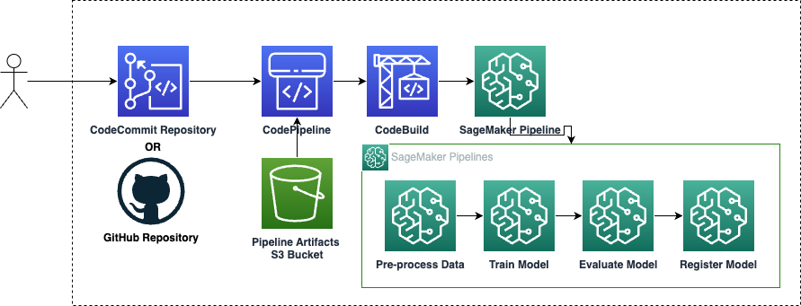
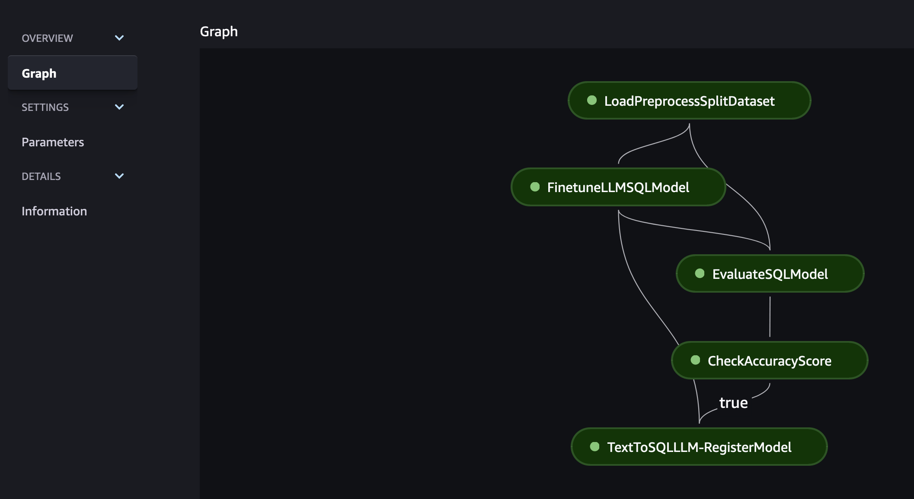
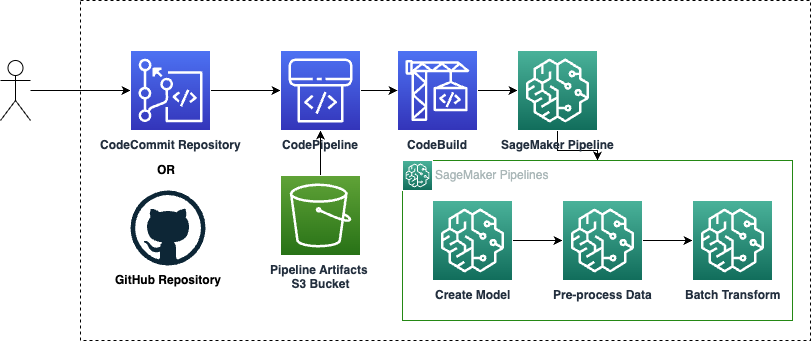
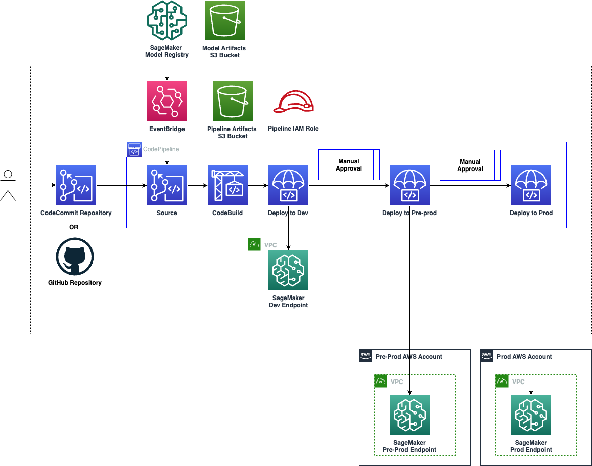

# SageMaker Project Templates

This module creates organizational SageMaker Project Templates. 

### Project Templates

The module contains ogranizational Project Templates.

#### Train a model on Abalone dataset with XGBoost Template

The template contains an example SageMaker Pipeline to train a model on Abalone dataset using XGBoost, and perform model evaluation.


#### LLM fine-tuning and evaluation

The template is based on LLM fine-tuning template from [AWS Enterprise MLOps Framework](https://github.com/aws-samples/aws-enterprise-mlops-framework/tree/main/mlops-multi-account-cdk/mlops-sm-project-template/mlops_sm_project_template/templates/finetune_deploy_llm_product).




The template is based on basic multi-account template from [AWS Enterprise MLOps Framework](https://github.com/aws-samples/aws-enterprise-mlops-framework/blob/main/mlops-multi-account-cdk/mlops-sm-project-template/README.md#sagemaker-project-stack).

#### Batch Inference Template

This project template contains SageMaker pipeline that performs batch inference.



#### Huggingface Model Import Template

This project template contains SageMaker pipeline that imports a hugging face model based on model id and access 
token inputs.


#### Multi-account Model Deployment Template

The template contains an example CI/CD pipeline to deploy the model endpoints to multiple AWS accounts. 



The template is based on basic multi-account template from [AWS Enterprise MLOps Framework](https://github.com/aws-samples/aws-enterprise-mlops-framework/blob/main/mlops-multi-account-cdk/mlops-sm-project-template/README.md#sagemaker-project-stack).

#### Third-party Code Repository Integration 
SageMaker templates support third party code repository (GitHub) integration along with default AWS CodeCommit. As part of integration, SageMaker templates will be able to manage (create, delete) repositories. As an example, if `sagemaker-templates-service-catalog` template configured to use GitHub as repository type then it would create code repository directly into GitHub account provided with manifest configuration. Repository will be named after SageMaker project name in AWS account `{sagemaker-project}-deploy`. For example, if SageMaker project name is `aiops-abalone-model` then GitHub repository would be created with name `aiops-abalone-model-deploy`.


## Prerequesites:
### AWS CodeCommit repository integration
- There isn't any prerequesite for using CodeCommit repository with SageMaker templates. It is supported as default repository.
> [!IMPORTANT] 
> It is important to note AWS CodeCommit is no longer available to new customers. Existing customers of AWS CodeCommit can continue to use the service as normal. 
### GitHub repository integration
- Target AWS account should contain AWS Secret Manager secret that contains GitHub personal access token with required permissions to manage repository. Refer guide [Creating a fine-grained personal access token](https://docs.github.com/en/authentication/keeping-your-account-and-data-secure/managing-your-personal-access-tokens#creating-a-fine-grained-personal-access-token) in order to create access token.
- Template also requires AWS CodeConnection created for GitHub provider in order to integrated GitHub repositories AWS CodeBuild and AWS CodePipeline. Refer guide [Create a connection to GitHub](https://docs.aws.amazon.com/dtconsole/latest/userguide/connections-create-github.html) in order to create connection with GitHub.

## Inputs and outputs:

### Required inputs:
- `project-template-type` - type of project template to deploy. Available options: `xgboost_abalone`, `batch_inference`, `finetune_llm_evaluation`, `hf_import_models`, `model_deploy`
- `sagemaker-project-name` - name of the SageMaker project
- `sagemaker-project-id` - unique identifier for the SageMaker project

### Common Optional Inputs:
- `repository-type` - type of repository to be integrated with SageMaker template source code. Options: `CodeCommit` (default), `GitHub`, `GitHub Enterprise`
- `repository-owner` - owner or organisation of project code repository (required for GitHub)
- `access-token-secret-name` - AWS Secret Manager secret name where access token is stored (default: `github_token`)
- `aws-codeconnection-arn` - AWS CodeConnection ARN for repository provider
- `sagemaker-domain-id` - SageMaker domain id
- `sagemaker-domain-arn` - SageMaker domain ARN for domain resource isolation
- `tags` - key-value pairs for resource tagging

#### Multi-account deployment parameters:
- `dev-vpc-id` - VPC id in dev environment
- `dev-subnet-ids` - list of subnet ids in dev environment
- `dev-security-group-ids` - list of security group ids in dev environment
- `pre-prod-account-id` - pre-prod account id
- `pre-prod-region` - pre-prod region
- `pre-prod-vpc-id` - VPC id in pre-prod environment
- `pre-prod-subnet-ids` - list of subnet ids in pre-prod environment
- `pre-prod-security-group-ids` - list of security group ids in pre-prod environment
- `prod-account-id` - prod account id
- `prod-region` - prod region
- `prod-vpc-id` - VPC id in prod environment
- `prod-subnet-ids` - list of subnet ids in prod environment
- `prod-security-group-ids` - list of security group ids in prod environment

### Project-specific Parameters:

#### XGBoost Abalone Template:
- `enable-network-isolation` - enable network isolation for training jobs (default: false)
- `encrypt-inter-container-traffic` - encrypt traffic between containers (default: false)

#### Model Deploy Template:
- `model-package-group-name` - name of the model package group (required)
- `model-bucket-name` - S3 bucket name for model artifacts (required)
- `enable-network-isolation` - enable network isolation for endpoints (default: false)

#### Hugging Face Import Models Template:
- `hf-access-token-secret` - AWS Secret Manager secret containing Hugging Face access token (required)
- `hf-model-id` - Hugging Face model identifier (required)

#### Batch Inference Template:
- `model-package-group-name` - name of the model package group (required)
- `model-bucket-name` - S3 bucket name for model artifacts (required)
- `base-job-prefix` - prefix for batch inference jobs (required)

### Sample manifest declaration

```yaml
name: templates
path: modules/sagemaker/sagemaker-templates
targetAccount: primary
parameters:
  # Below are the optional properties passed to the multi-account CI/CD deployment template
  - name: dev-account-id
    valueFrom:
      envVariable: PRIMARY_ACCOUNT
  - name: dev-region
    valueFrom:
      envVariable: PRIMARY_REGION
  - name: dev-vpc-id
    valueFrom:
      moduleMetadata:
        group: networking
        name: networking
        key: VpcId
  - name: dev-subnet-ids
    valueFrom:
      moduleMetadata:
        group: networking
        name: networking
        key: PrivateSubnetIds
  - name: pre-prod-account-id
    valueFrom:
      envVariable: PRE_PROD_ACCOUNT
  - name: pre-prod-region
    valueFrom:
      envVariable: PRE_PROD_REGION
  - name: pre-prod-vpc-id
    valueFrom:
      moduleMetadata:
        group: networking
        name: networking-pre-prod
        key: VpcId
  - name: pre-prod-subnet-ids
    valueFrom:
      moduleMetadata:
        group: networking
        name: networking-pre-prod
        key: PrivateSubnetIds
  - name: prod-account-id
    valueFrom:
      envVariable: PROD_ACCOUNT
  - name: prod-region
    valueFrom:
      envVariable: PROD_REGION
  - name: prod-vpc-id
    valueFrom:
      moduleMetadata:
        group: networking
        name: networking-prod
        key: VpcId
  - name: prod-subnet-ids
    valueFrom:
      moduleMetadata:
        group: networking
        name: networking-prod
        key: PrivateSubnetIds
  - name: sagemaker-domain-id
    valueFrom:
      moduleMetadata:
        group: sagemaker-studio
        name: studio
        key: StudioDomainId
  - name: sagemaker-domain-arn
    valueFrom:
      moduleMetadata:
        group: sagemaker-studio
        name: studio
        key: StudioDomainArn
```
### Sample manifest example for source repository options
[sagemaker-templates-modules-github.yaml](/examples/manifests/sagemaker-templates-modules-github.yaml)
[sagemaker-templates-modules-codecommit.yaml](/examples/manifests/sagemaker-templates-modules-codecommit.yaml)